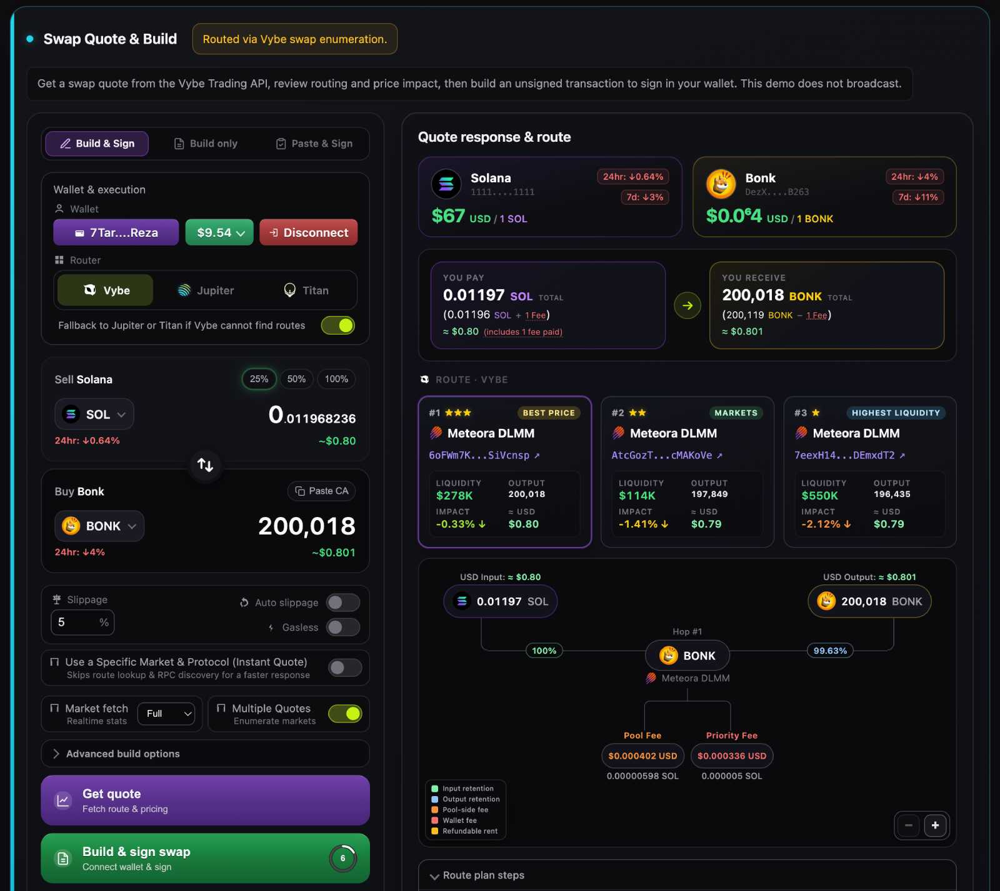
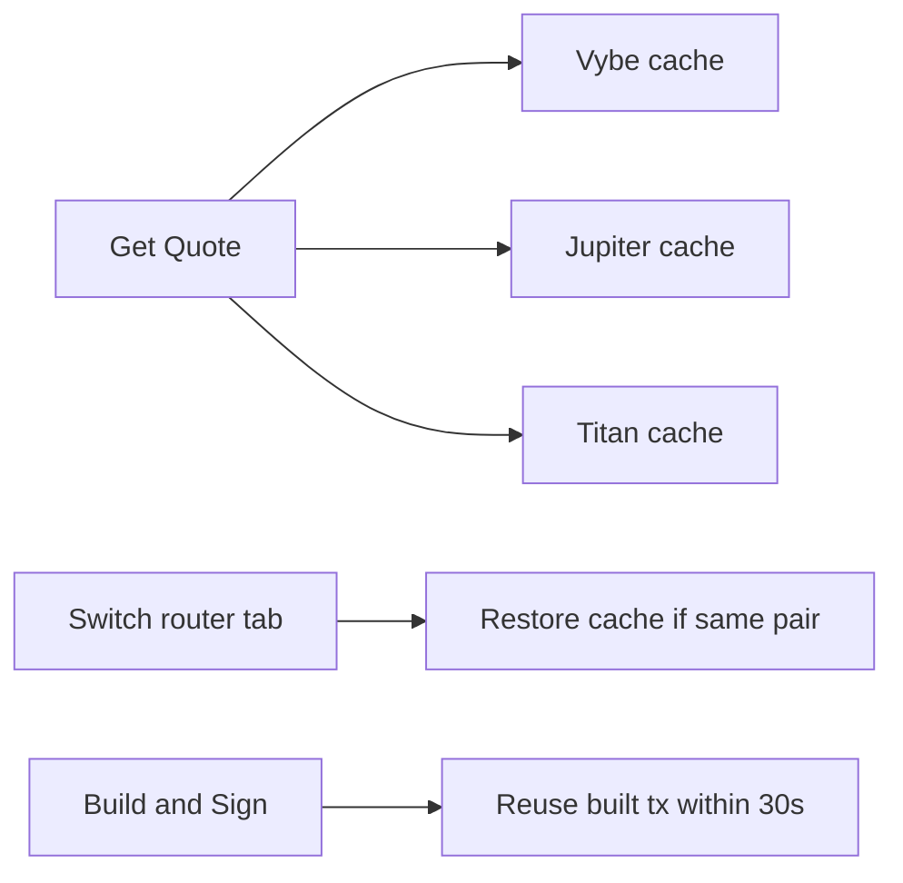

# Solana Swap API

<p align="center">

[](https://solana-swap-api.vybenetwork.com)
[](https://github.com/vybenetwork/solana-swap-api)
[](https://docs.vybenetwork.com/docs/swap-overview)
[](https://docs.vybenetwork.com/reference/get_swap_quote_proxy)
[](https://docs.vybenetwork.com/reference/do_swap_proxy)
[](https://x.com/Vybe_Network)
</p>

**Solana Swap API:** This repository demonstrates how to use the Vybe Solana swap API to fetch DEX quotes, compare Vybe/Jupiter/Titan routes, and build unsigned swap transactions for any SPL or Token-2022 token. Use this project as a reference implementation or starter kit for building Solana swap UIs, wallet integrations, and on-chain trading apps.

It includes a production-ready Node.js backend and a modern frontend that integrate Vybe’s swap quote, swap build, token price, and wallet balance endpoints—explore multi-hop route diagrams, per-hop fee breakdowns, and base64 unsigned transactions ready for wallet signing.

Try the live demo: https://solana-swap-api.vybenetwork.com



---

- **[Try the LIVE demo →](https://solana-swap-api.vybenetwork.com)**
- **[Get your free Vybe API key →](https://vybe.fyi/api-pricing)**
- **[Vybe swap overview →](https://docs.vybenetwork.com/docs/swap-overview)**
- **[Swap quote endpoint →](https://docs.vybenetwork.com/reference/get_swap_quote_proxy)**
- **[Build swap endpoint →](https://docs.vybenetwork.com/reference/do_swap_proxy)**
- **[GitHub repo →](https://github.com/vybenetwork/solana-swap-api)**
- **[Telegram →](https://t.me/VybeNetwork_Official)**
- **[X →](https://x.com/Vybe_Network)**

---

## Prerequisites

- **Node.js** ≥ 20 (LTS recommended)
- **npm** ≥ 10 (or equivalent)

## Quick Start

Get from clone to running app in a few commands:

```bash
git clone https://github.com/vybenetwork/solana-swap-api.git
cd solana-swap-api
npm install
cp .env.example .env
# Edit .env: set VYBE_DATA_API_KEY (required); set VYBE_API_KEY for swap quote/build
npm start
```

Then open **http://localhost:3000**, pick a router (Vybe, Jupiter, or Titan), set sell/buy mints and amount, connect a wallet (or paste an address), and click **Get quote**. The default mode is **Build & Sign swap**, which builds and opens a confirm dialog for your wallet; switch to **Build only** to copy an unsigned base64 transaction, or **Paste & Sign** to sign an existing one.

## Environment Variables

| Variable         | Required | Description                                              | Example                                |
|------------------|----------|----------------------------------------------------------|----------------------------------------|
| `VYBE_DATA_API_KEY`   | Yes*     | Key for wallets, tokens, trades (`VYBE_DATA_API_BASE`)   | `your_api_key_here`                    |
| `VYBE_API_KEY`        | No       | Key for swap quote/build (`VYBE_API_BASE`); empty OK local | `your_api_key_here`                  |
| `VYBE_API_BASE`       | No       | Trading API (swap quote/build); local Rust/proxy for dev | `https://api.vybenetwork.xyz`          |
| `VYBE_DATA_API_BASE`  | No       | Wallets, tokens, trades (defaults prod when trading local)| `https://api.vybenetwork.xyz`         |
| `HELIUS_API_KEY`      | No       | Helius RPC key (used when `SOLANA_RPC_URL` unset)        | `your_helius_key`                      |
| `SOLANA_RPC_URL` | No       | Full RPC URL override (wins over `HELIUS_API_KEY`)       | `https://api.mainnet-beta.solana.com` |
| `PORT`           | No       | HTTP server port (default `3000`)                        | `3000`                                 |
| `ENABLE_SWAP_QUOTE_BTN_DEBUG` | No | Show inline "Get quote blocked" debug meta under the quote button | `true`                  |
| `DISABLED_QUOTE_BRIDGE_HOP_COMBOS` | No | Skip quote-bridge routes for hop protocol pairs (comma-separated short keys) | `damm2-damm2`     |
| `TUNNEL`         | No       | Set to `1` to run behind a Cloudflare Tunnel             | `1`                                    |

Get your API keys at `https://vybe.fyi/api-pricing`.

\* `VYBE_DATA_API_KEY` is required unless `VYBE_API_KEY` is set (used as fallback for data endpoints).

---

## What This Repo Provides

- **Swap quote and build proxy**
  - Express server that proxies Vybe:
    - `GET /v4/trading/swap-quote` (Jupiter / Titan quote path)
    - `POST /v4/trading/swap` (build unsigned swap transaction)
    - `GET /v4/tokens/{mintAddress}` (token metadata + price fields)
    - Wallet balance and sell-balance checks via Vybe wallet APIs
- **Vybe quote + build flow**
  - `POST /api/trading/vybe-quote` resolves token prices, builds via Vybe router, and synthesizes a full quote + route plan in one call.
  - Built transaction is reused without rebuilding while the **30s Build & Sign window** is active, with a shorter **10s hot reuse** for unchanged params.
  - **Per-router quote cache** — switching the Vybe / Jupiter / Titan tab restores that router's last quote, route plan, and timers (separate timers for Get Quote vs Build).
- **Swap web UI**
  - Single-page GUI (no frameworks) built from `src/frontend/` into `public/app.js`.
  - Lets you quote, compare routes, inspect fees, and build or sign swap transactions for any SPL or Token-2022 pair.
- **Three execution modes**
  - **Build & Sign** (default) — quote, build, then a confirm dialog that opens immediately and signs in a Phantom-compatible wallet.
  - **Build only** — quote + build; copy base64 unsigned transaction.
  - **Paste & Sign** — paste existing base64 tx, refresh blockhash, sign in wallet.
- **Three router options**
  - **Vybe** — native Vybe routing with route discovery and optional fallback to Jupiter or Titan.
  - **Jupiter** — quote via `swap-quote`, then immediate swap build.
  - **Titan** — same aggregator flow as Jupiter through the Vybe proxy.
- **Vybe route discovery** (Vybe router only)
  - **Market fetch** mode: `full` / `trades` / `markets` / `rpc`.
  - **Multiple Quotes** — enumerate markets and rank up to 3 route options.
  - **Pin a specific market & protocol** for an instant quote that skips discovery.
- **Route options panel**
  - Up to three ranked market cards for Vybe; Jupiter and Titan show the real route as card #1 with #2/#3 placeholders.
  - The route header always shows the active router icon and name (e.g. `Route · Jupiter`).
- **Sign confirm dialog**
  - Opens immediately on **Build & Sign**, with balance-change cards, network fee, transaction size (shows `— bytes` until built), route, live progress logs, and retry / refetch actions.
- **Quote-fetch UI lock**
  - While a quote is fetching, token pickers, amount, slippage, build options, router tabs, mode tabs, and the wallet tray are disabled until it finishes.
- **Route visualization and fee accounting**
  - Multi-hop route diagram with per-hop fee branches (protocol, pool, acc rent, priority).
  - Route plan steps with IN / pre-fees output / NET tiles and **Paid from wallet** / **Deducted from pool** fee tables.
  - Hop % badges aligned between diagram and accordion headers.
- **Wallet-aware token picker**
  - Jupiter token catalog search + connected wallet holdings.
  - 25 / 50 / 100% sell shortcuts, SOL reserve guards, low-SOL warnings for SPL sells.
- **Token price pair cards**
  - 24h / 7d price change for sell and buy mints via `POST /api/tokens/resolve-prices`.

The server does **not** broadcast transactions. **Build & Sign** and **Paste & Sign** may send only from the user’s browser wallet after explicit confirmation.

All of this uses Vybe’s production swap routing across Raydium, Orca, Meteora, Pump.fun, and other Solana DEX aggregators via Vybe, Jupiter, and Titan.

---

### Solana API docs for these endpoints

- **Swap overview (guides)**:
  - [https://docs.vybenetwork.com/docs/swap-overview](https://docs.vybenetwork.com/docs/swap-overview)
- **Swap quote (`GET /v4/trading/swap-quote`)**:
  - [https://docs.vybenetwork.com/reference/get_swap_quote_proxy](https://docs.vybenetwork.com/reference/get_swap_quote_proxy)
- **Build swap (`POST /v4/trading/swap`)**:
  - [https://docs.vybenetwork.com/reference/do_swap_proxy](https://docs.vybenetwork.com/reference/do_swap_proxy)
- **Token details (`GET /v4/tokens/{mintAddress}`)**:
  - [https://docs.vybenetwork.com/reference/get_token_details_v4](https://docs.vybenetwork.com/reference/get_token_details_v4)

---

## Why Swap Quote & Build APIs Matter

Swap quote and transaction build APIs are critical for:

- **Trading UIs**: show expected output, price impact, slippage, and min receive before the user signs.
- **Route transparency**: visualize multi-hop paths and every fee debited from wallet or pool.
- **Wallet integrations**: return base64 unsigned transactions for Phantom, Solflare, and other signers.
- **Aggregator choice**: compare Vybe-native routing vs Jupiter or Titan through one proxy.
- **Production safety**: enrich route fees from build responses (the server simulates internally for fee/output accuracy) and refresh blockhash before sign.

This repo shows how to build a **practical swap explorer and builder** on top of Vybe’s quote and swap endpoints.

---

## Frontend Overview (Swap UI)

The swap UI is implemented in `src/frontend/` and compiled to `public/app.js` via `npm start` (which runs `npm run build:frontend` first).

| File | Role |
|------|------|
| `app.ts` | Swap widget, quote/build flows, router switching, wallet connect, sign dialog |
| `route-ui.ts` | Route diagram, route plan steps, hop % badges, router header, sign confirm summary |
| `token-picker.ts` | Token search, wallet balances, icons, sell-amount helpers |
| `protocol-picker.ts` | Pin-a-market protocol picker for Vybe route discovery |
| `swap-tx-network-fee.ts` | Network fee estimate for the sign confirm dialog |
| `price-impact-tier.ts` / `liquidity-tier.ts` | Price-impact and liquidity warning tiers |
| `format-warn-pct.ts` | Shared percent formatting helpers |

### Sections

- **Wallet & execution**
  - Signer address input, Phantom-compatible **Connect wallet**, total USD balance chip, disconnect.
  - Router switch: Vybe / Jupiter / Titan, each with its own cached quote restored when you switch tabs.
  - Router fallback toggles: Vybe → Jupiter or Titan; Jupiter ↔ Titan (Titan's Jupiter fallback is display-only).
  - Slippage (default **5%**), gasless, auto slippage, partner, service fee sent on build. Simulation runs internally for fee/output enrichment — it is not a user toggle.

- **Vybe route discovery** (Vybe router only)
  - **Market fetch** mode selector: `full` / `trades` / `markets` / `rpc`.
  - **Multiple Quotes** — enumerate candidate markets and rank route options.
  - **Pin a specific market & protocol** (pool address + protocol picker) for a direct quote.
  - These controls are disabled when the Jupiter or Titan router is active.

- **Sell / Buy sides**
  - Token picker (catalog + wallet holdings), amount input, flip button, 25/50/100% sell shortcuts.
  - Live USD estimates and 24h / 7d pair cards for both mints.

- **Quote response & route panel**
  - Route header always shows the active router icon and name (e.g. `Route · Jupiter`), even before a quote.
  - Quote summary, route diagram, collapsible **Route plan steps**, **Top-level API fields**, raw quote/swap JSON.
  - Up to three ranked **route option** cards (Vybe); Jupiter and Titan show the real route as #1 with #2/#3 placeholders.
  - After **Get quote**, **Route plan steps** opens automatically if another panel was expanded.

- **Route diagram**
  - Input/output pills, per-hop DEX nodes, fee branches, hop retention % badges on rail links.
  - Unknown protocols fall back to a placeholder icon instead of rendering nothing.

- **Route plan steps**
  - Accordion hops with IN / pre-fees output / NET tiles.
  - Fee groups: **Paid from wallet**, **Deducted from pool** with recipient addresses and USD amounts.
  - Single-hop routes stay expanded; multi-hop allows one open hop at a time.

- **Sign confirm dialog** (Build & Sign)
  - Opens immediately when you click **Build & Sign** (or **Refetch then Build & Sign**), before background work finishes.
  - Shows balance-change cards, network fee, **Transaction size** (`— bytes` placeholder until built), the route, and live progress logs.
  - Actions for retry / refetch on failure; calls `POST /api/solana/prepare-swap-tx` to refresh blockhash so the wallet can simulate balance changes.

- **Quote-fetch UI lock**
  - While a quote is fetching, token pickers, amount, slippage, build options, router tabs, mode tabs, and the wallet tray are locked until the fetch completes.

- **Build result**
  - Base64 unsigned transaction textarea + copy (Build only).

### Execution modes

| Mode | Quote | Build | Sign | Broadcast |
|------|-------|-------|------|-----------|
| **Build & Sign** (default) | Yes | Yes | In-browser wallet (immediate confirm dialog) | Optional (wallet sends) |
| **Build only** | Yes | Yes | No | No |
| **Paste & Sign** | No | No (paste base64) | In-browser wallet | Optional (wallet sends) |

### Quote & build workflow

1. **Get quote**
   - **Vybe** — `POST /api/trading/vybe-quote` resolves prices, builds swap, synthesizes quote + enriched route.
   - **Jupiter / Titan** — `GET /api/trading/swap-quote` then `POST /api/trading/swap` with the quote `routePlan`.
   - Each router keeps its own cache; switching tabs restores that router's last quote and timers.
2. **Build / sign** — within the **30s Build & Sign window** the cached transaction is reused without rebuilding (with a **10s hot reuse** for unchanged params); after that the button switches to **Refetch then Build & Sign**. A separate **10s Get Quote cooldown** rate-limits requote.
3. **Copy base64** (Build only) or sign/send in wallet (Build & Sign / Paste & Sign).



---

## SOL Balance Thresholds

These UI amounts (in SOL) guard wallet balance checks. They are not env vars — edit source constants if you need different limits.

| Constant | Value | Description |
|----------|-------|-------------|
| `SOL_MIN_TX_FEE_BALANCE_UI` | `0.006` | Minimum SOL when **selling an SPL token** (non-gasless). Warns to enable **Gasless** or deposit more SOL. |
| `SOL_WALLET_MIN_RESERVE_UI` | `0.006` | SOL reserve when **selling native/wrapped SOL** — max sell = total minus reserve. |
| `SOL_MIN_TRADABLE_TOTAL_UI` | `0.0061` | Minimum total SOL before a SOL sell is allowed. |
| `SOL_MIN_AUTO_PICK_TOTAL_UI` | `0.0065` | Minimum total SOL to auto-select SOL as sell token when loading wallet balances. |

Defined in `src/config.ts`, `src/api/wallet-balance.ts`, `src/api/trade-sol-warning.ts`, and `src/frontend/token-picker.ts`.

---

## Server Proxy Routes

The Express server in `src/server.ts` exposes:

- **`GET /api/trading/swap-quote`**
  - Aggregator quote via Vybe `GET /v4/trading/swap-quote`: `amount` (UI units), `inputMintAddress`, `outputMintAddress`, optional `accountAddress`, `slippage`.
  - When `router` (`vybe` \| `jupiter` \| `titan`) is set, returns a router-specific quote **and** build in one call (requires `accountAddress`; Vybe also accepts `marketFetchMode`, `enumerateRoutes`).
- **`POST /api/trading/vybe-quote`**
  - Resolves token prices + builds via the chosen `router` (defaults to `vybe`). Returns the synthesized quote plus `_build`, `_builtAt`, `_tokenStats`, and (when discovered) `_routeDiscovery`.
  - Body extends the swap build body with route-discovery fields: `marketFetchMode` (`full` \| `trades` \| `markets` \| `rpc`), `enumerateRoutes`, `poolAddress`, `programAddress`, `protocol` (pin a market), and `forceFullDetailsMints`.
- **`POST /api/trading/swap`**
  - Proxies to Vybe `POST /v4/trading/swap` with JSON body: `accountAddress`, `amount`, mints, optional `slippage`, `router` (`vybe` \| `jupiter` \| `titan`), `gasless`, `autoCalculateSlippage`, `partner`, `poolAddress`, `protocol`, `swapFee`. Response is enriched with simulated output, fees, and display fields.
- **`GET /api/trades`**
  - Proxies Vybe `GET /v4/trades` for a market or mint (filters: `marketAddress`, `mintAddress`, `programAddress`, `baseMintAddress`/`quoteMintAddress`, `limit` (max 1000, default 250), `page`, sort). Returns an empty list with a warning if upstream 404s.
- **`GET /api/route-discovery/top-markets`**
  - Ranks the top trade markets for a pair from recent trades: `inputMintAddress`, `outputMintAddress`, optional `limit`, `topN`.
- **`POST /api/tokens/resolve-prices`**
  - Cache-first price stats (`price`, `price1d`, `price7d`) for pair cards.
- **`GET /api/token/:mint`**
  - Proxies to Vybe `GET /v4/tokens/{mintAddress}`; cached in `data/token-meta-cache.json`.
- **`GET /api/token-symbol/:mint`**
  - Resolves symbol via Metaplex and/or Vybe; cached in `data/symbol-cache.json`.
- **`POST /api/token-symbols`**
  - Batch symbol lookup for multiple mints.
- **`GET /api/wallets/:ownerAddress/token-balances`**
  - Wallet SPL holdings for token picker (`limit`, default 50, max 100).
- **`GET /api/wallets/:ownerAddress/sell-balance-check`**
  - Query: `mint`, `amount`, optional `symbol` — verify sell amount before quote.
- **`GET /api/wallets/:ownerAddress/low-sol-trade-warning`**
  - Query: `inputMint`, optional `outputMint`, `gasless` — SPL sell SOL warning.
- **`POST /api/solana/rpc`**
  - Proxy JSON-RPC to `SOLANA_RPC_URL` (browser Connection).
- **`GET /api/solana/latest-blockhash`**
  - Fresh blockhash for wallet simulation.
- **`POST /api/solana/prepare-swap-tx`**
  - JSON: `{ tx }` base64 — refresh blockhash + resolve ALTs before sign.
- **`GET /api/health`**
  - Health check `{ ok: true }`.
- **`GET /api/ui-config`**
  - Frontend feature flags (e.g. `enableSwapQuoteBtnDebug`).
- **`GET /cached/token-icons/*`**
  - Cached token icon assets.

All Vybe requests use a shared client (`src/api/client.ts`) with timeouts, retries, and human-readable errors (`toHumanReadableError`). Symbol and token-meta caches are JSON files in `data/`.

---

## npm Scripts

| Script | Description |
|--------|-------------|
| `npm start` | Build frontend + run Express server (`tsx src/server.ts`) |
| `npm run dev` | Same as start |
| `npm run build` | Compile server TypeScript → `dist/` |
| `npm run build:frontend` | Bundle `src/frontend/` → `public/app.js` |
| `npm run typecheck` | Server typecheck |
| `npm run typecheck:frontend` | Frontend typecheck |
| `npm run fetch:catalog` | Fetch Jupiter token catalog for picker |
| `npm run download:token-icons` | Download token icons into cache |

---

## How to Run

### 1. Clone the repository

```bash
git clone https://github.com/vybenetwork/solana-swap-api.git
cd solana-swap-api
```

### 2. Install dependencies

```bash
npm install
```

### 3. Set your API key

```bash
cp .env.example .env
# Set VYBE_DATA_API_KEY (required); add VYBE_API_KEY for swap quote/build
```

### 4. Run the server + web app

```bash
npm start
```

Then open **http://localhost:3000**. The UI shows **swap quote and route** data for any SPL or Token-2022 pair: choose router (Vybe, Jupiter, or Titan), enter sell/buy mints and amount, connect a wallet, and click **Get quote**. Inspect the route diagram and fee breakdown, then **Build & Sign** (default), **Build only**, or **Paste & Sign**.

### 5. (Optional) Run with Cloudflare Tunnel

To expose the app on a public URL (e.g. for sharing or testing from another device), you can enable a tunnel (requires `cloudflared` installed):

```bash
TUNNEL=1 npm start
```

The console will print a **Cloudflare Tunnel URL** if supported.

---

## Project Structure

```text
solana-swap-api/
├── .env.example           # Copy to .env — VYBE_DATA_API_KEY / VYBE_API_KEY, optional HELIUS_API_KEY / SOLANA_RPC_URL
├── package.json           # Scripts and pinned dependencies
├── README.md
├── screenshots/           # Screenshots referenced in this README
├── data/                  # Disk caches (symbol, token meta, program labels, holders)
├── public/                # Web GUI (HTML, CSS, built JS)
│   ├── index.html
│   ├── app.css
│   ├── app.js             # Generated by `npm run build:frontend` from src/frontend/
│   ├── favicon.svg        # Vybe router icon
│   ├── data/              # Token catalog (json + tsv) for the picker
│   └── images/            # Router + DEX logos, token-icon-placeholder.svg
├── tools/
│   ├── bundle-frontend.mjs            # Bundles src/frontend → public/app.js
│   ├── fetch-jupiter-token-catalog.mjs
│   ├── download-token-icons.mjs
│   └── local-vybe-proxy.mjs           # Optional local Vybe proxy for dev
└── src/
    ├── server.ts          # Express server; proxies Vybe API and serves public/
    ├── config.ts          # Env loading, API base URLs, timeouts, SOL thresholds, default slippage
    ├── cache.ts           # On-disk symbol cache in data/
    ├── token-icon-cache.ts
    ├── wallet-balance-limit.ts
    ├── types/
    │   ├── api.ts
    │   ├── swap.ts
    │   └── enrichment.ts
    ├── api/
    │   ├── index.ts               # createClient(apiKey) — wires all API methods
    │   ├── client.ts              # HTTP client, retries, human-readable errors
    │   ├── swap-quote.ts          # GET /v4/trading/swap-quote (aggregator)
    │   ├── swap-build.ts          # POST /v4/trading/swap (+ enrichment)
    │   ├── vybe-swap-quote.ts     # Vybe quote + build orchestration
    │   ├── route-discovery.ts     # Rank top markets, enumerate route options
    │   ├── pinned-swap-params.ts  # Pin a specific market / protocol
    │   ├── quote-bridge-detect.ts # Bridge-hop route detection
    │   ├── resolve-token-prices.ts
    │   ├── trades.ts              # GET /v4/trades
    │   ├── wallet-balance.ts      # Wallet holdings + sell-balance checks
    │   ├── trade-sol-warning.ts
    │   ├── token-symbol.ts        # Symbol resolution (Metaplex / Vybe)
    │   ├── tokens.ts
    │   ├── solana-prepare-swap-tx.ts  # Refresh blockhash + ALTs before sign
    │   └── …                      # fee/ATA helpers, sol-mints, connection utils
    └── frontend/
        ├── app.ts                 # Swap UI (quote, build, routers, sign dialog) → public/app.js
        ├── route-ui.ts            # Route diagram, plan steps, router header, sign summary
        ├── token-picker.ts        # Token search + wallet balances
        ├── protocol-picker.ts     # Pin-a-market protocol picker
        ├── swap-tx-network-fee.ts # Network fee estimate for the sign dialog
        ├── price-impact-tier.ts   # Price-impact warning tiers
        ├── liquidity-tier.ts
        └── format-warn-pct.ts
```

---

## Direct API Usage Example

If you want to bypass the UI and fetch quotes / build swaps through the local proxy:

```typescript
const base = 'http://localhost:3000';

// Quote (Jupiter / Titan path). slippage is a whole percent (5 = 5%).
const quoteParams = new URLSearchParams({
  amount: '0.05',
  inputMintAddress: 'So11111111111111111111111111111111111111112',
  outputMintAddress: 'DezXAZ8z7PnrnRJjz3wXBoRgixCa6xjnB7YaB1pPB263',
  slippage: '5',
});
const quoteRes = await fetch(`${base}/api/trading/swap-quote?${quoteParams}`);
const quote = await quoteRes.json();
console.log('outAmountUi', quote.outAmountUi);

// Build unsigned transaction (server enriches fees/output via internal simulation)
const buildRes = await fetch(`${base}/api/trading/swap`, {
  method: 'POST',
  headers: { 'Content-Type': 'application/json' },
  body: JSON.stringify({
    accountAddress: 'YOUR_WALLET_PUBKEY',
    amount: 0.05,
    inputMintAddress: 'So11111111111111111111111111111111111111112',
    outputMintAddress: 'DezXAZ8z7PnrnRJjz3wXBoRgixCa6xjnB7YaB1pPB263',
    slippage: 5,
    router: 'vybe',
  }),
});
const { transaction } = await buildRes.json();
console.log('base64 length', transaction?.length);
```

Or call Vybe directly:

```typescript
import axios from 'axios';

const API = 'https://api.vybenetwork.xyz';
const headers = { 'X-API-KEY': process.env.VYBE_API_KEY!, Accept: 'application/json' };

async function fetchSwapQuote(inputMint: string, outputMint: string, amount: number) {
  const { data } = await axios.get(`${API}/v4/trading/swap-quote`, {
    params: {
      amount,
      inputMintAddress: inputMint,
      outputMintAddress: outputMint,
      slippage: 5,
    },
    headers,
  });
  return data;
}

async function buildSwapTx(
  accountAddress: string,
  inputMint: string,
  outputMint: string,
  amount: number,
  routePlan: unknown[],
) {
  const { data } = await axios.post(
    `${API}/v4/trading/swap`,
    {
      accountAddress,
      amount,
      inputMintAddress: inputMint,
      outputMintAddress: outputMint,
      slippage: 5,
      router: 'vybe',
      routePlan,
    },
    { headers },
  );
  return data.transaction as string;
}
```

---

## Troubleshooting

| Issue | What to do |
|-------|------------|
| **403 Forbidden** | Verify `VYBE_API_KEY` in `.env` is correct and has access to swap quote and build endpoints. If the key works locally but not on a server, it may be IP-restricted — contact Vybe to allow your server IP. |
| **Slow responses / timeouts** | The app uses a 60s timeout for Vybe requests and retries. If the API is under load, you may see timeouts; check Vybe status or retry later. |
| **Missing env vars** | Ensure you copied `.env.example` to `.env` and set `VYBE_API_KEY`. |
| **Build fails without wallet** | `accountAddress` is required for swap build routes. Get a quote first so mints and amount match. |
| **Phantom simulation / balance changes** | Use **Build & Sign** so the UI calls `prepare-swap-tx` before signing. |
| **Low SOL warning on SPL sell** | Enable **Gasless** or keep ≥ ~0.006 SOL for fees/rent (see thresholds above). |
| **Build button says "Refetch then Build & Sign"** | The cached quote/build expired (30s Build & Sign window). Click it to requote and rebuild before signing; a 10s Get Quote cooldown may briefly rate-limit requests. |

---

## Support

- **Telegram:** [VybeNetwork Official](https://t.me/VybeNetwork_Official)
- **X:** [@Vybe_Network](https://x.com/Vybe_Network)
- **GitHub:** [solana-swap-api](https://github.com/vybenetwork/solana-swap-api)
- **Support ticket:** [Submit a ticket via vybenetwork.com](https://vybenetwork.com)
